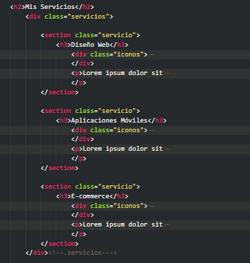

# Website mockup using HTML, CSS, and NORMALIZE.CSS

## 🔎 **I will use this page to explain some aspects of the code because I am a beginner, and this will help me reinforce my knowledge**

##### The HTML document starts with metadata defined in the <head> section. These tags describe the document’s settings and behavior, including character encoding, viewport configuration, page title, and links to stylesheets and external resources.

````html
<head>
    <!--UTF-8 helps the browser display text correctly-->
    <meta charset="UTF-8">
    <!--This tag makes the website adapt to different screen sizes on mobile devices-->
    <meta name="viewport" content="width=device-width, initial-scale=1.0">
    <title>PW</title> <!--seo-->
    <link rel="preload" href="normalize.css" as="style">
    <link rel="stylesheet" href="normalize.css">
    <link rel="preload" href="styles.css" as="style">
    <link href="https://fonts.googleapis.com/css2?family=TASA+Explorer:wght@400..800&display=swap" rel="stylesheet">
    <!--This line connects your HTML to your CSS file-->
    <link rel="stylesheet" href="styles.css">
</head>
````

##### Preload is an HTML attribute. It's used in <span>`link`</span> elements to tell the browser to preload a resource, improving performance.

````html
<link rel="preload" href="styles.css" as="style">
````

##### The “hero” section: the prominent top part of the page that introduces who you are and what you do. It usually contains a headline h2, a short location/info block (the SVG + “Santiago de Chile”), and a call-to-action button (“Contactar”). Its purpose is to quickly show visitors the main message and invite them to take action (like contacting you)

````html
<section class="hero">
    <div class="contenido-hero">
        <h2>Diseño y Desarrollo Web</h2>
        <div class="ubicacion">
            <svg
            width="88"
            height="88"
            viewBox="0 0 24 24"
            fill="none"s
            stroke="#ffc107"
            stroke-width="1"
            stroke-linecap="round"
            stroke-linejoin="round"
            xmlns="http://www.w3.org/2000/svg">
            <path d="M12 12m-9 0a9 9 0 1 0 18 0a9 9 0 1 0 -18 0" />
            <path d="M12 17l-1 -4l-4 -1l9 -4z" />
            </svg>
            <p>Santiago de Chile</p>
        </div>
        <a class="boton" href="#">Contactar</a>
    </div><!--.contenido-hero-->
</section>
````

##### The class attribute in HTML is used to identify one or more elements and to apply styles to them or manipulate them with JavaScript.

````html
<header>
    <h1 class="titulo">Matías Celis <span>Junior Developer</span></h1>
</header>
````

##### In CSS, we select classes like this: ".titulo span". This line of code allows us to modify the size of the span element that belongs to the "titulo" class.

````css
.titulo span{
    font-size: 2rem;
}
````

##### Div is a generic container used to group elements. In this snippet, we'll group the navigation bar links.

````html
<div class="nav-bg"> <!--El div no puede ir dentro de un nav-->
    <nav class="navegacion-principal contenedor">
        <a href="#">Inicio</a>
        <a href="#">Sobre Mi</a>
        <a href="#">Clientes</a>
        <a href="#">Contacto</a>
    </nav>
</div>
````

##### The class "servicio" is applied to a div that acts as the main container to group all the services. Within that container, there are multiple section elements with the class "servicio" (one for each individual service: "Diseño Web", "Aplicaciones Móviles", and "E-commerce"). This creates a parent-child relationship: the div with the class "servicios" is the parent, and each section with the class "servicio" is a child.



##### In index.html, this fragment does not have a container class or id, but it is a section that contains the form.

##### What does a form do? A form collects user data and can send it: *input type="text" → nombre, input type="number" → teléfono, input type = "email" → correo, textarea → mensaje, input type = "submit" → botón enviar*.

#####  What is a fieldset? A fieldset visually and semantically groups several related fields within a form.

##### Legend is the label that goes inside a fieldset and describes the group of fields in the form.

````html
<section>
    <h2>Contacto</h2>
    <form class="formulario">
        <fieldset>
            <legend>Contactanos llenando todos los campos</legend>

                <div class="contenedor-campos">

                    <div class="campo">
                        <label>Nombre</label>
                        <input class="input-text" type="text" placeholder="Ingresa tu nombre">
                    </div>

                    <div class="campo">
                        <label>Telefono</label>
                        <input class="input-text" type="number" placeholder="Ingresa tu telefono">
                    </div>

                    <div class="campo">
                        <label>Correo</label>
                        <input class="input-text" type="email" placeholder="Ingresa tu correo">
                    </div>

                    <div class="campo">
                        <label>Mensaje</label>
                        <textarea class="input-text"></textarea>
                    </div>

                </div> <!--contenedor-campos-->

                <div class="alinear-derecha flex">
                    <input class="boton w-sm-100" type="submit" value="Enviar">
                </div>
        </fieldset>
    </form>
</section>
````

##### In this index.html, footer class="footer" contains: **All rights reserved. Matias Celis** It's semantic: it indicates footer content (copyright, contact, legal links, credits).

````html
<footer class="footer">
    <p>Todos los derechos reservados. Matias Celis</p>
</footer>
````